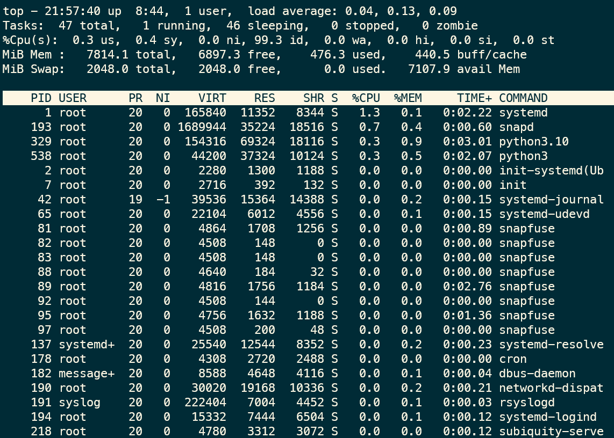
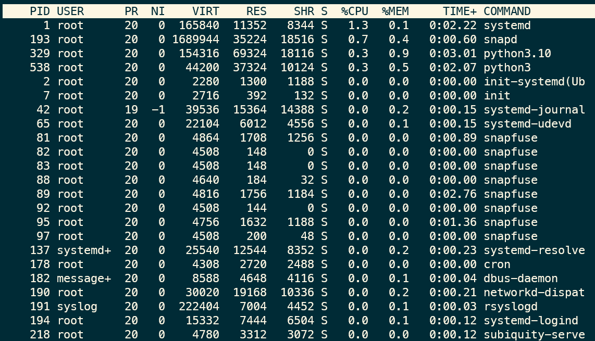
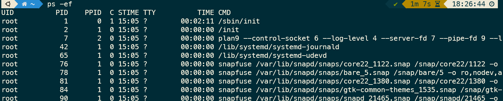
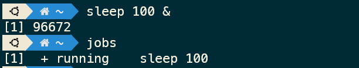

# 20212744 윤태건 오픈소스SW개론 과제

---

## TOP

top 명령어는 현재 os의 상태를 알려주는 명령어로 크게 요약영역과 디테일영역으로 나눌 수 있다

#### 요약영역

요약영역은 상단에 위치한 구역으로 주로 OS에 대해서 전체 프로세스가 리소스를 어느정도
차지하고 있는지를 알려준다.
최상단 에서는 시스템의 현재 시간, OS가 살아있는 시간, 현재 접속중인 유저 수, 로드 애버리지를 확인 할 수 있다. 로드 애버리지 에서는 CPU Load의 이동 평균을 나타낸다. 앞에서 부터 1분, 5분, 15분에 대한 평균값이다.

\*CPU Load CPU가 수행하는 작업의 양

###### Tasks

2번째 줄에는 Tasks에 대한 내용으로 Tasks는 현재 프로세스들의 상태를 나타내는 영역이다. total은 전체 프로세스, running은 running상태인 프로세스, sleeping은 대기상태인 process, stopped는 종료된 프로세스, zombies는 좀비상태인 프로세스의 수를 나타낸다.

###### CPU 사용량(%Cpu(s))

Tasks 아래 CPU 사용량을 보여주는 영역이 있으며 CPU가 어떻게 사용되는지 그 사용률을 보여준다 모든 값의 총 합은 100%이며 이를 퍼센테이지로 나누어 보여준다.
각 요소의 뜻은 다음과 같다.

- us : 프로세스의 유저 영역에서의 CPU 사용률
- sy : 프로세스의 커널 영역에서의 CPU 사용률
- ni : 프로세스의 우선순위(priority) 설정에 사용하는 CPU 사용률
- id : 사용하고 있지 않는 비율
- wa : IO가 완료될때까지 기다리고 있는 CPU 비율
- hi : 하드웨어 인터럽트에 사용되는 CPU 사용률
- si : 소프트웨어 인터럽트에 사용되는 CPU 사용률
- st : CPU를 VM에서 사용하여 대기하는 CPU 비율

###### 메모리 사용량

CPU 사용량 영역아래에 메모리와 관련된 영역이 있다. 첫번째 줄은 RAM의 메모리 영역으로 Mem이라 표시되어있는 부분이다. 그리고 아랫줄은 디스크를 메모리 처럼 이용하는 Swap 메모리 영역이다. 일반적으로 Mem의 사용량이 거의 가득 찼을때 Swap 메모리 영역을 사용하지만 이 영역은 디스크이기 때문에 RAM 메모리보다 속도가 많이 느린 단점을 가지게 된다.

- total : 총 메모리
- free : 사용가능한 메모리
- used : 사용중인 메모리

buff/cachee에서 buff는 buffers의 약자이다. 이 값은 커널 버퍼에서 사용되는 메모리를 뜻합니다. cache는 Disk의 페이지 캐시를 뜻한다. 즉, buff/cache는 IO와 관련되어 사용되는 버퍼에 사용되는 메모리. 이 메모리가 있으므로써 IO에 상대적으로 빠른 속도를 가질 수 있다. avail Mem은 swap 메모리를 사용하지 않고 사용할 수 있는 메모리의 크기이다.

#### 디테일 영역

디테일 영역에서는 각 프로세스에 대한 상세한 내용을 다룬다. 각 요소는 다음과 같다.

- PID
  - 프로세스 ID로 프로세스를 구분하기위한 겹치지않는 고유값이다.
- USER
  - 해당 프로세스를 실행한 USER 또는 효과를 받는 USER의 이름.
- PR, NI
  - PR : 커널에 의해서 스케줄링되는 우선순위.
  - NI : PR에 영향을 주는 nice값.
- VIRT, RES, SHR, %MEM
  - VIRT : 프로세스가 소비하고 있는 총 메모리.
  - RES : RAM에서 사용중인 메모리의 크기.
  - SHR : 다른 프로세스와의 공유메모리.
  - %MEM : RAM에서 RES가 차지하는 비율.
- S
  - 프로세스의 현재 상태.
- TIME
  - 프로세스가 사용한 총 CPU시간.
- COMMAND
  - 해당 프로세스를 실행한 커맨드.

#### 유용한 top커맨드

###### k - kill process

윈도우의 작업관리자 처럼 top에서도 프로세스를 종료할 수 있다 해당 기능을 사용하기 위한 커맨드는 k이며 이후 종료하고자하는 프로세스의 PID를 입력하면 된다.

---

## PS

ps 명령어는 현재 실행 중인 프로세스와 그 상태를 출력하는 명령어이다
보통 grep,more,less 명령어와 같이 사용한다. ps 명령어의 출력은 주로 다음과 같다

- UID : 프로세스 소유자의 이름
- PID : 프로세스의 식별 번호
- PPID : 부모 프로세스의 PID
- C : CPU 사용률
- STIME : 프로세스 시작 시간
- TTY : 프로세스와 연결된 터미널
- TIME : 총 CPU 사용 시간
- CMD : 프로세스의 실행 명령행
  이밖에도 다양한 출력을 옵션을 통해 볼 수 있다.

#### ps 명령어 옵션

주로 사용하는 ps 명령어 옵션은 다음과 같다.

- A : 모든 프로세스를 출력
- e : 커널 프로세스를 제외한 모든 프로세스를 출력
- f : 출력을 풀 포맷으로 표기
- o : 출력 포맷지정
- l : 출력을 긴 포맷으로 표기
- p : 특정 PID를 지정하여 출력
- t : 특정 TTY에서 실행되는 프로세스 출력

#### 사용 예

###### ps -ef

-ef옵션은 동작 중인 모든 프로세스를 소유자 정보와 함께 풀 포맷으로 출력하는 명령어 이다.

###### ps -el

프로세스의 정보가 긴 포맷으로 출력된다 -ef옵션보다 더 다양한 정보가 출력된다.

###### ps -t [tty 명]

특정 TTY에서 실행되는 프로세스를 출력한다.

###### ps -p [프로세스 번호]

프로세스 번호를 이용하여 해당 프로세스 정보를 출력한다.

###### ps -u [사용자명]

특정 사용자의 프로세스 정보를 추력한다.

---

## jobs

jobs 명령어는 셸에서 실행중인 프로세스목록을 확인하는 명령어 이다.
jobs 명령어의 기본형식은 다음과 같다.**jobs [OPTIONS] [JOB]** 보통 옵션이나 인자없이 주로 사용하나 실행중인 작업이 없다면 아무것도 출력되지 않는다.
각 항목이 의미하는 바는 다음과 같다.

- [1]+ : 대괄호 안의 숫자는 잡 ID이며 해당 번호는 현재 셸에서만 유효하다 그 다음에 있는 +는 bg나 fg명령 실행시 기본인자로 사용된다는 의미.
- running : 프로세스의 상태를 나타낸다. 현재는 running으로 실행중이라는 의미
- sleep 100 : 프로세스를 실행한 명령어

jobs 명령어에 인자를 지정하여 특정 프로세스만 확인이 가능하다.
인자는 %[job_ID] 형식으로 지정한다.

#### jobs 명령어의 옵션

jobs 명령어에서 사용할 수 있는 주요한 옵션은 다음과 같다.

- ㅣ : 프로세스 ID와 함께 잡목록 출력
- n : 마지막 알림 이후 변경된 잡만 출력.
- p : 잡의 프로세스 ID만 출력.
- r : 실행 중인 잡만 출력.
- s : 중지된 잡만 출력.

---

## kill

프로세스를 종료하기위해 사용하는 명령어이다 해당 명령을 사용하려면 종료하려는 프로세스의 PID를 구해야하는데 보통 ps 명령어를 사용해 확인 할 수 있다. (ps -ef | grep 프로세스명)

kill 옵션에서 주로 사용하는 것은 -9, -15 가 있다.

###### kill -15 <PID>

프로세스 정상 종료
메모리상에 있는 데이터와 각종 설정/환경 파일을 안전하게 저자한 후 프로세스를 종료한다.

###### kill -9 <PID>

프로세스 강제종료
리눅스 커널이 프로세스를 강제로 종료한다 이때문에 데이터 손실이 발생 할 수 있다.
